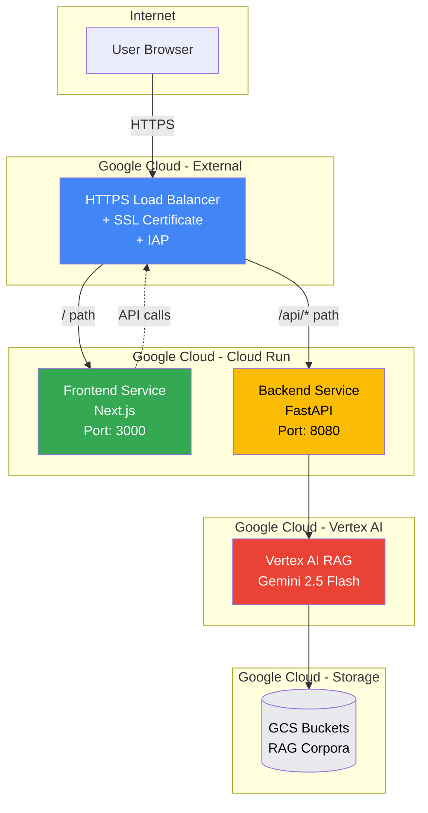

# ADK RAG Agent – Demonstration Slides

Executive-friendly walkthrough of the application flow, security, and architecture.

---

## 1. High-Level Flow

1. **User visits the app URL** (e.g., `https://34.149.125.180.nip.io`)
2. **IAP triggers Google OAuth** and enforces organization access
3. **After authentication**, user is routed to the Next.js frontend
4. **Frontend calls Backend API** over the Load Balancer
5. **Backend orchestrates the ADK Vertex RAG Agent** to answer questions
6. **Answers stream back** to the frontend chat UI

---

## 2. Authentication with Google IAP (OAuth)

### What is IAP?
Identity-Aware Proxy (IAP) is a Google Cloud security layer that controls access to your application.

### How It Works
- **IAP is enabled on the HTTPS Load Balancer** backend services
- **Enforces Google OAuth** with your configured brand and OAuth client
- **Only allowed domains** gain access (e.g., `@develom.com`, `@fedgovai.com`, `@usda.gov`)

### Authentication Flow
1. User visits app → **IAP redirects to Google OAuth consent screen**
2. User **signs in with Google account**
3. Google validates the account against allowed domains
4. User **grants consent** to the OAuth application
5. **IAP authorizes** the request and forwards to frontend
6. User now has access to the application

### Configuration Files
- `infrastructure/lib/iap.sh` - IAP and OAuth client configuration
- `infrastructure/lib/oauth.sh` - OAuth consent screen setup
- `infrastructure/validate-deployment.sh` - IAP validation checks

### Security Benefits
- **No anonymous access** - all requests must pass OAuth
- **Domain-restricted** - only specified email domains allowed
- **Google-managed authentication** - leverages enterprise Google Workspace
- **Automatic token validation** - IAP handles all OAuth token verification

---

## 3. Frontend ↔ Backend Communication

### Architecture
- **Frontend**: Next.js app running on Cloud Run
- **Backend**: FastAPI application running on Cloud Run
- **Load Balancer**: Routes traffic based on path

### Routing Configuration
```
HTTPS Load Balancer
├── "/" → Frontend (Cloud Run)
└── "/api/*" → Backend (Cloud Run)
```

### How Frontend Knows Backend URL
- **Build-time injection**: `_BACKEND_URL` → `NEXT_PUBLIC_BACKEND_URL`
- **Configuration**: Set in `frontend/cloudbuild.yaml`
- **Runtime access**: Frontend reads `NEXT_PUBLIC_BACKEND_URL` environment variable
- **API calls**: Frontend makes requests to this URL (e.g., `/api/chat`)

### CORS (Cross-Origin Resource Sharing)
- **Backend CORS policy** allows:
  - Local development: `http://localhost:3000`, `http://127.0.0.1:3000`
  - Production: Value from `FRONTEND_URL` environment variable
- **Configuration**: `backend/src/api/server.py` (lines ~262-277)
- **Security**: No wildcard origins in production (enforced by CI)

### Request Flow Example
1. User types message in chat → Frontend
2. Frontend sends POST to `/api/chat`
3. Load Balancer routes to Backend
4. Backend processes and returns response
5. Frontend displays streamed answer

---

## 4. Backend ↔ ADK Vertex RAG Agent

### Account Configuration System
- **Multi-account support**: Backend can serve different accounts (develom, usfs, tt)
- **Selection**: Via `ACCOUNT_ENV` environment variable
- **Config files**: `backend/config/<account>/config.py`
- **Loader**: `backend/config/config_loader.py`

### Vertex AI Initialization
- **Environment precedence** (from highest to lowest):
  1. Cloud Run environment variables (`PROJECT_ID`, `GOOGLE_CLOUD_LOCATION`)
  2. Account-specific defaults (`backend/config/<account>/config.py`)
  3. Fallback hardcoded defaults (avoided where possible)
- **Initialization**: `backend/src/rag_agent/__init__.py`
- **Server setup**: `backend/src/api/server.py`

### ADK Vertex Agent Configuration
- **Agent definition**: `backend/config/<account>/agent.py`
- **Model**: Gemini 2.5 Flash via Vertex AI
- **Tools available**:
  - `rag_query` - Query documents in RAG corpus
  - `list_corpora` - List all available corpora
  - `create_corpus` - Create new document corpus
  - `add_data` - Add documents to corpus
  - `get_corpus_info` - Get corpus metadata
  - `delete_document` - Remove specific documents
  - `delete_corpus` - Remove entire corpus

### How Agent Processes Requests
1. Backend receives chat message from frontend
2. Backend loads appropriate agent based on `ACCOUNT_ENV`
3. Agent analyzes user query
4. Agent selects appropriate tool (e.g., `rag_query`)
5. Agent calls Vertex AI RAG API with query
6. Vertex AI retrieves relevant documents from corpus
7. Gemini generates contextual answer
8. Backend streams response to frontend

---

## 5. Data and RAG Corpora

### Document Storage
- **Location**: Google Cloud Storage (GCS) buckets
- **Example**: `gs://tt-rag-books` (contains 100+ technical books)
- **Formats supported**: PDF, TXT, DOCX, and more

### Vertex AI RAG Service Agent
- **Identity**: `service-${PROJECT_NUMBER}@gcp-sa-vertex-rag.iam.gserviceaccount.com`
- **Purpose**: Google-managed service account for Vertex AI RAG operations
- **Required permission**: `roles/storage.objectViewer` on GCS buckets
- **Creation**: Auto-created when Vertex AI RAG API is enabled

### Backend Service Account
- **Identity**: `adk-rag-agent-sa@<project>.iam.gserviceaccount.com`
- **Roles**:
  - `roles/aiplatform.admin` - Full Vertex AI access
  - `roles/storage.admin` - GCS bucket management
  - `roles/bigquery.admin` - BigQuery operations
- **Setup**: Automated in `infrastructure/lib/infrastructure.sh`

### Corpus Management
- Users can:
  - List existing corpora
  - Create new corpora for organizing documents
  - Add documents via Google Drive or GCS URLs
  - Query specific corpora
  - Delete documents or entire corpora

---

## 6. Security Highlights

### Identity and Access Management
- ✅ **IAP (Google OAuth)** on Load Balancer
- ✅ **Domain-restricted access** - only authorized email domains
- ✅ **No anonymous access** to application surface
- ✅ **Service account separation** - backend and frontend use different SAs
- ✅ **Least privilege** - RAG service agent has minimal required permissions

### Network Security
- ✅ **External HTTPS** terminates at Load Balancer with SSL certificate
- ✅ **Backend protocol** is HTTP via serverless NEG (recommended pattern)
- ✅ **Internal-only ingress** - Cloud Run services not publicly accessible
- ✅ **Load Balancer routing** - centralized entry point

> **Note**: For TLS-to-backend explanation, see `docs/WHY-NOT-HTTPS.md`

### Secrets Management
- ✅ **SECRET_KEY** provided via `secrets.env` (not in repository)
- ✅ **No hardcoded credentials** in source code
- ✅ **Cloud Run environment variables** for runtime configuration
- ✅ **Service account keys** managed by Google (no manual key files)

### Configuration Integrity
- ✅ **Environment precedence enforced** - runtime env overrides account defaults
- ✅ **CI validation** - ensures no wildcard CORS in production
- ✅ **Input validation** - preflight checks in `infrastructure/validate-deployment.sh`
- ✅ **No default secrets** - CI blocks hardcoded SECRET_KEY values

### Code Security
- ✅ **Type checking** with mypy
- ✅ **Linting** with flake8 and isort
- ✅ **Security scanning** with Bandit
- ✅ **Dependency checks** with Safety

---

## 7. End-to-End Demo Script

### Step 1: Navigate to Application URL
- Open browser to deployment URL (e.g., `https://34.36.213.78.nip.io`)
- **Expected**: Redirect to Google OAuth consent screen

### Step 2: Sign In with Google
- Use authorized organization account (e.g., `user@develom.com`)
- **Expected**: OAuth consent screen → Grant permissions → Redirect to app

### Step 3: Explore Home Page
- View landing page with application description
- Click "Chat" or "Get Started"
- **Expected**: Chat interface loads

### Step 4: Ask a Question
- Type: *"List all available corpora"*
- **Expected**: Agent uses `list_corpora` tool and displays results

### Step 5: Query Documents
- Type: *"What are the key topics in the AI books?"*
- **Expected**: Agent uses `rag_query` tool, retrieves context, generates answer

### Step 6: Stream Response
- **Observe**: Answer appears token-by-token (streaming)
- **Backend logs**: Show resolved `PROJECT_ID`, `GOOGLE_CLOUD_LOCATION`, agent load

### Step 7: Validate Security
- **Test 1**: Try accessing with non-allowed account → Access denied
- **Test 2**: Inspect browser console → CORS allowed origins visible
- **Test 3**: Check backend logs → No authentication errors

---

## 8. Operations and Deployment

### Deployment Orchestration
**Main script**: `infrastructure/deploy-all.sh`

**Modules**:
1. **Prerequisites** (`infrastructure/lib/prerequisites.sh`)
   - Validate gcloud authentication
   - Enable required Google Cloud APIs

2. **Infrastructure** (`infrastructure/lib/infrastructure.sh`)
   - Create Artifact Registry
   - Set up service accounts
   - Configure IAM permissions

3. **Cloud Run** (`infrastructure/lib/cloudrun.sh`)
   - Build and push container images
   - Deploy backend and frontend services
   - Configure environment variables

4. **OAuth** (`infrastructure/lib/oauth.sh`)
   - Configure OAuth consent screen
   - Create OAuth client

5. **Load Balancer** (`infrastructure/lib/loadbalancer.sh`)
   - Set up HTTPS load balancer
   - Configure SSL certificate
   - Create URL map and routing rules

6. **IAP** (`infrastructure/lib/iap.sh`)
   - Enable IAP on backend services
   - Attach OAuth client
   - Set access policies

7. **Finalization** (`infrastructure/lib/finalize.sh`)
   - Configure CORS
   - Rebuild frontend with correct backend URL
   - Display deployment summary

### Configuration Inputs
- **`deployment.config`**: Core settings (PROJECT_ID, REGION, ACCOUNT_ENV, etc.)
- **`secrets.env`**: Secret values (SECRET_KEY)
- **Validation**: `./infrastructure/validate-deployment.sh`

### Continuous Integration
- **Workflow**: `.github/workflows/env-config.yml`
- **Tests**: Environment precedence, CORS policy, secret validation
- **Triggers**: Pushes and PRs to `testing`/`main` branches

---

## 9. Architecture Diagram



### Key Points
- **TLS terminates at Load Balancer** (HTTPS → HTTP to services)
- **IAP protects both routes** (frontend and backend)
- **Services are isolated** from public internet
- **Backend coordinates** all Vertex AI interactions

---

## 10. Key Files Reference

### Frontend/Backend Deployment
- `infrastructure/deploy-all.sh` - Main deployment orchestrator
- `infrastructure/lib/*.sh` - Modular deployment functions
- `deployment.config` - Core configuration variables
- `secrets.env` - Secret values (gitignored)

### Backend Code
- `backend/src/api/server.py` - FastAPI server and CORS config
- `backend/config/config_loader.py` - Account config loader
- `backend/config/<account>/config.py` - Account-specific settings
- `backend/config/<account>/agent.py` - ADK agent definition

### Agent and Tools
- `backend/src/rag_agent/__init__.py` - Vertex AI initialization
- `backend/src/rag_agent/agent.py` - ADK agent setup
- `backend/src/rag_agent/tools/*` - RAG operation tools

### Documentation
- `docs/ENV-CONFIG-STRATEGY.md` - Environment configuration approach
- `docs/ENV-CONFIG-TESTING.md` - Testing and validation guide
- `docs/WHY-NOT-HTTPS.md` - HTTPS/HTTP backend explanation

### CI/CD
- `.github/workflows/env-config.yml` - Environment config checks
- `.github/workflows/ci.yml` - Full CI/CD pipeline

---

## 11. Permissions Checklist

### IAP Configuration
- ✅ OAuth consent screen published
- ✅ OAuth client created and attached to LB backend service
- ✅ Allowed domains configured (organization restrictions)
- ✅ IAP enabled on frontend and backend services

### Service Accounts
- ✅ `adk-rag-agent-sa` bound to backend Cloud Run service
- ✅ `adk-rag-agent-sa` has Vertex AI permissions (aiplatform.admin)
- ✅ `adk-rag-agent-sa` has Storage permissions (storage.admin)
- ✅ Vertex AI RAG service agent has storage.objectViewer on RAG buckets

### Environment Variables
- ✅ `ACCOUNT_ENV` - Selects account configuration
- ✅ `PROJECT_ID` - GCP project for Vertex AI
- ✅ `GOOGLE_CLOUD_LOCATION` - Region for Vertex AI
- ✅ `FRONTEND_URL` - CORS allowed origin
- ✅ `SECRET_KEY` - JWT signing key (from secrets.env)

### Network and SSL
- ✅ Static IP reserved
- ✅ SSL certificate provisioned and active
- ✅ Load balancer configured with HTTPS proxy
- ✅ URL map routes configured

---

## 12. Troubleshooting Quick Reference

### Issue: Cannot access application
- **Check**: IAP is enabled → verify OAuth client attached
- **Check**: User email in allowed domain
- **Validate**: `./infrastructure/validate-deployment.sh`

### Issue: Frontend shows CORS error
- **Check**: `FRONTEND_URL` environment variable set on backend
- **Check**: Load balancer URL matches `FRONTEND_URL`
- **View**: Backend logs for CORS configuration output

### Issue: RAG queries fail
- **Check**: Vertex AI RAG service agent has storage.objectViewer
- **Check**: Corpus exists and has documents
- **Check**: `PROJECT_ID` and `GOOGLE_CLOUD_LOCATION` correct

### Issue: Backend fails to start
- **Check**: Environment variables set (ACCOUNT_ENV, PROJECT_ID, etc.)
- **Check**: Service account has Vertex AI permissions
- **View**: Cloud Run logs for initialization errors

---

## Summary

The ADK RAG Agent application demonstrates:
- ✅ **Enterprise-grade security** with Google IAP and OAuth
- ✅ **Scalable architecture** using Cloud Run and Load Balancer
- ✅ **Multi-account support** with isolated configurations
- ✅ **Advanced AI capabilities** with Vertex AI RAG and Gemini
- ✅ **Production-ready deployment** with automated infrastructure
- ✅ **Comprehensive testing** with CI/CD validation

This MVP showcases how organizations can build secure, scalable, and intelligent document query systems using Google Cloud's managed services and Vertex AI.
